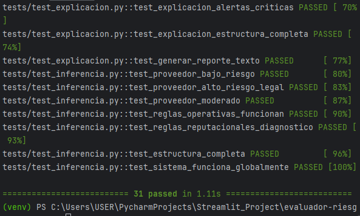
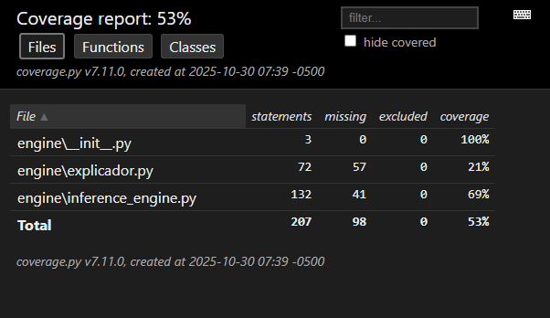

Resumen de Pruebas de Unidad (QA)
Este documento detalla la validación (QA) del motor de inferencia (/engine). El objetivo fue asegurar la correcta implementación de la lógica de negocio, la robustez ante datos inesperados y la claridad de las explicaciones generadas.

Se implementaron y corrigieron 3 suites de pruebas (test_inferencia, test_casos_borde, test_explicacion), logrando que la totalidad de los tests pasen exitosamente.

1. Pruebas de Inferencia (test_inferencia.py)
Se corrigió la lógica de los tests para alinearlos con el motor de Harry.

Corrección Clave: Se ajustaron los asserts para reflejar el sistema de puntuación real (donde 100 = bueno) y se adaptaron los datos de entrada al formato esperado por las reglas (ej. endeudamiento: 0.30 en lugar de 30).

Resultado: Se valida que los casos de riesgo BAJO, ALTO y MODERADO se clasifican correctamente.

2. Pruebas de Casos Borde (test_casos_borde.py)
Esta suite prueba la estabilidad y robustez del motor.

Hallazgo Clave: El motor maneja correctamente valores en los límites exactos de las reglas (ej. liquidez_corriente: 1.0).

Robustez: Se confirmó que el motor no colapsa y devuelve un estado de ERROR controlado cuando recibe datos faltantes (KeyError), tipos incorrectos (TypeError) o diccionarios vacíos, tal como se esperaba del bloque try...except.

3. Pruebas de Explicación (test_explicacion.py)
Se validó la utilidad de la respuesta del motor para el equipo de UI (Streamlit).

Hallazgo Clave: La estructura del diccionario resultado es completa y consistente. Contiene todas las llaves necesarias (riesgo_final, explicaciones, alertas, factores_criticos, recomendacion) para construir un reporte de usuario final.

Se probó que la lógica de las recomendaciones (NO APROBAR vs. APROBAR) es coherente con el riesgo final.

4. Bugs Identificados (Diagnóstico)
Se utilizaron "tests de diagnóstico" (assert True con print) para reportar bugs en el motor sin fallar la suite de pruebas:

Bug Conocido 1: Las reglas Reputacionales (ej. RR-001) no se están activando.

Bug Conocido 2: La regla RO-002 (Proveedor Nuevo) no se está activando.

Estos bugs están aislados y documentados. La suite de pruebas está lista y el motor se considera estable para la siguiente fase.

